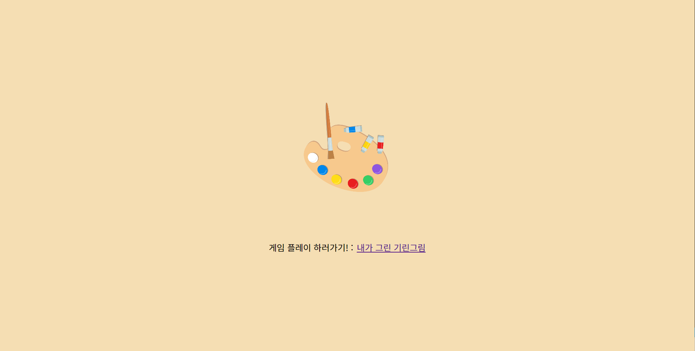

내가그린 기린그림 
========================
그림 퀴즈 게임 백엔드(소켓) 서버
-----------------------------

</img>

>__BE서버 주소 : https://paintgame-backend.herokuapp.com/__

> 게임 플레이하기!
> >* __FE 주소 : <https://priceless-hoover-994589.netlify.app/>__

> 백엔드 서버 내용
>> __INDEX화면이 심심해서 React 기본화면처럼 구성해봤습니다 :)__   
>> Express로 백엔드 서버를 구성하였으며, FE서버와 소켓통신으로 데이터를 주고받습니다.   